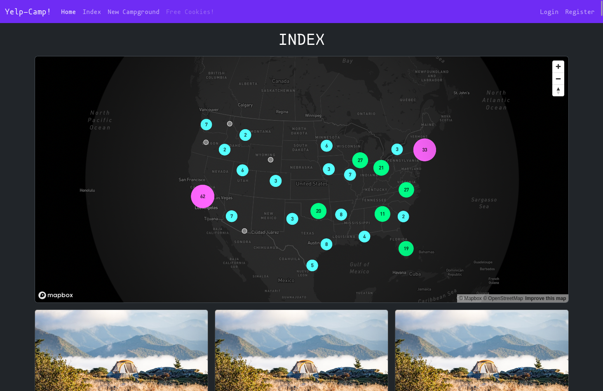

# YelpCamp

Small website to share camping sites and post reviews. It's the final project for [Colt Steele's web developer bootcamp](https://www.udemy.com/course/the-web-developer-bootcamp/). 
It uses expressjs, mongodb, passportjs, bootstrap and others. 

## dotenv

Needs a few variables set int the `.env` in order to connect to the Cloudinary and MapBox services:  
- `CLOUDINARY_CLOUD_NAME` 
- `CLOUDINARY_API_KEY` 
- `CLOUDINARY_API_SECRET` 
- `CLOUDINARY_URL` 
- `MAPBOX_TOKEN`

## Seeding the database 

Use `node seeds/index.js` to seed the `yelp-camp` database with randomized names and locations of american cities. 

## ToDo

- most of the front end needs to be re-written for responsiveness. 
- need to set up HelmetJS for security. 
- probably more stuff I haven't spoted/thught about yet...
